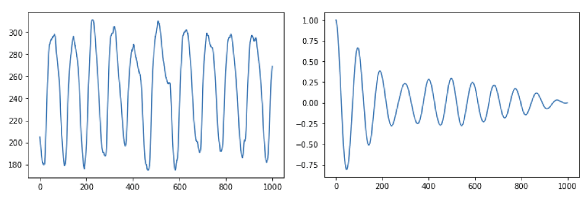
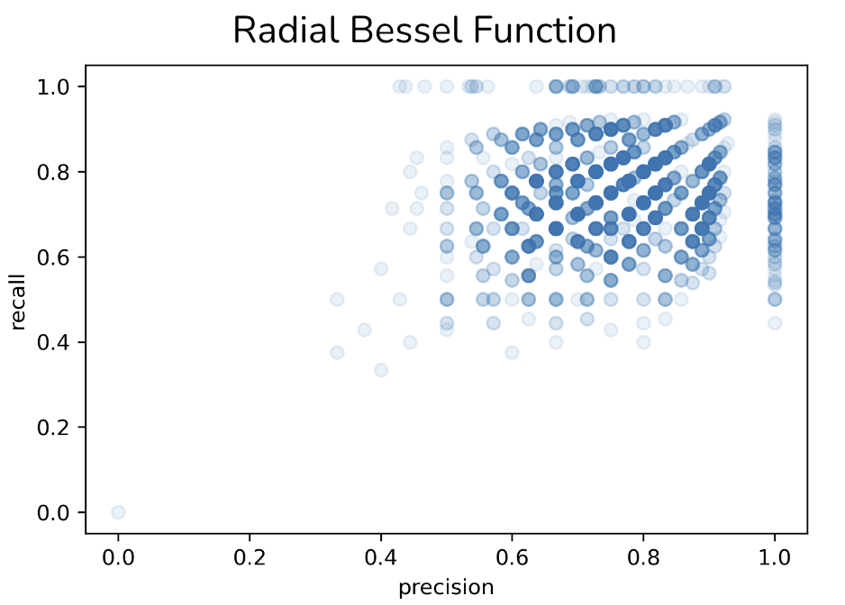
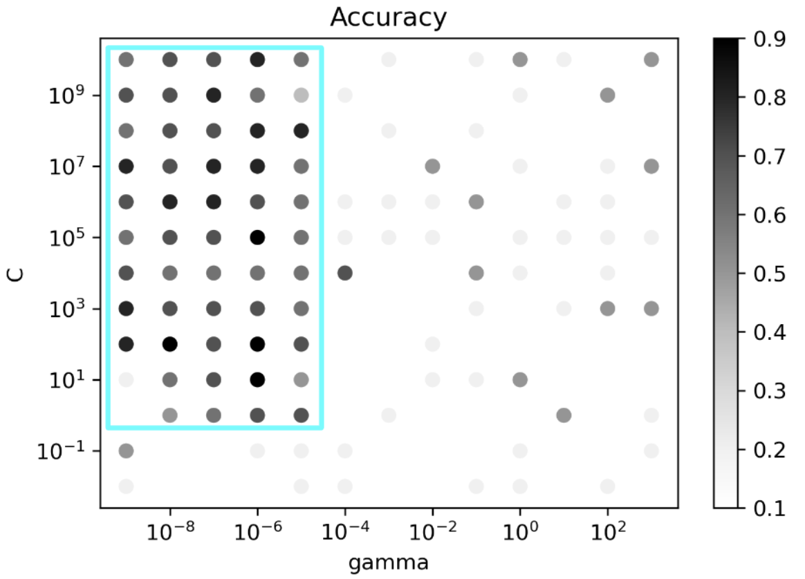
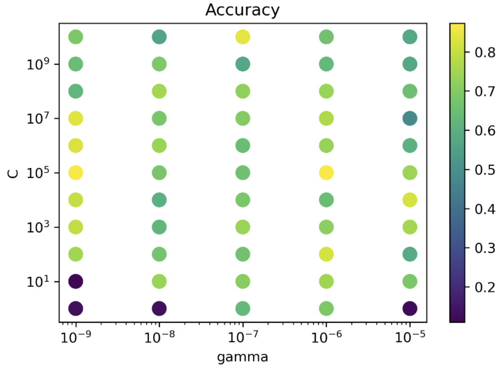

**Abstract**

Motion, particularly from breathing, compromises the quality of magnetic resonance images. In this work, we hypothesize that detected breathing patterns can be utilized to predict whether adequate MR image quality will be obtained. With a K-means clustering algorithm, 9 in 10 40-second breathing waveforms were correctly predicted as either resulting in a high or low quality image; this finding can save time from unnecessary scans. Other models achieved similar results as K-means clusterings.

**Introduction**

Respiratory motion compromises the quality of magnetic resonance images. One active area of research to address this problem is new MRI data acquisition techniques, such as non-Cartesian k-space scanning [1]. Another approach is development of new motion detection methods, such as utilization of the MRI signal itself to extract motion estimates [2]; these estimates can be used in new image reconstruction algorithms to correct motion artifacts. Despite the considerable progress in all of these methods, motion-related artifacts remains a major problem. Little work has focused on predicting whether image quality will be acceptable, and has been focused on voluntary head movement [3]. 

Some work has focused on characterizing respiration for monitoring of sedation [4], and far more work explores on characterizing respiratory motion during radiotherapy delivery [5, 6], or even influencing the respiratory motion [7]. In [8], the authors explored methods to characterize breathing pattern and restrict MRI data acquisition to certain portions of the respiratory cycle. To date, limited work has explored more modern machine learning methods to characterize breathing patterns [9].

In this work, we hypothesize that detected breathing patterns can be utilized to predict whether adequate MR image quality will be obtained. This prediction can then be utilized to either trigger a decision to repeat a scan, coach the patient, choose an alternative MRI technique, or simply omit that scan and thereby save scan time.

**Methods**

Abdominal scans from pediatric patients scanned at our institution over an eighteen month period that utilized a post-contrast motion-robust non-Cartesian scan were retrospectively identified with IRB approval and waived consent. The pulse sequence was a spoiled gradient echo with an intermittent spectrally-selective fat suppression pulse. The k-space trajectory was a cones pattern with a golden angle ordering [10]. Slice thickness and field of view were adjusted to fit patient size. Bandwidth of 125 kHz and flip angle of 15 degrees were utilized. Image reconstruction consisted of gridding followed by fourier transform. 

_Figure 1. Left: 1000 data point segment from representative breathing waveform. Right: corresponding autocorrelation function._

_Figure 2. Example image quality scores of 1-5._

Corresponding breathing waveforms, sampled at a 40 ms fixed rate, from a respiratory bellows were curated (Fig. 1, left). For a subset of 61 waveforms, a board certified radiologist scored resulting image quality on a five-point Likert scale (Fig. 2), with high scores of 4 and 5 deemed diagnostically adequate; this high and low classification allows for each waveform to fall into a binary categorization. The remaining 675 waveforms were unlabeled. 

To sample the unlabeled set of respiratory waveforms, ten segments of equal length were randomly extracted from each respiratory waveform. To sample the labeled waveforms, one segment of each waveform was randomly extracted. The total of these extractions comprise two groups of waveforms: labeled and unlabeled respiratory waveforms. These two groups of labeled and unlabeled respiratory waveforms were then resampled at varying segment lengths in different trials. Thus, there was a labeled and unlabeled pair of groups of waveforms for each segment length.

K-means clustering was performed on the raw unlabeled waveform group, where k varied from two to 16 clusters. Clustering was performed twice: (i) with raw unlabeled waveforms, and (ii) on the autocorrelation of the respiratory waveforms (Fig. 1, right). With the exception of a singular datapoint withheld for testing, the assigned cluster of the remaining labeled data points were tabulated; the majority label determined the overall cluster label (low quality or high quality). The resulting labeled cluster model 

was then used to predict the image quality of the withheld data point. This process was repeated for 

each labeled datapoint being withheld, enabling calculation of specificity, sensitivity, and accuracy. K-means clustering was also performed on the unlabeled waveform group but autocorrelation (Fig. 1, right) preprocessing was used.

In addition, respiratory waveform segment length was varied from 250 to 2000 datapoints long, increasing by an interval of 250 datapoints. The best accuracy was whichever of the 15 number of clusters (from two to sixteen) with the highest performance. 

The K-means clustering method was run for a hundred trials, except instead of using all 675 unlabeled datapoints in each trial, 300 randomly selected out of the 675 waveforms were used instead to prevent overfitting. Error bars are the standard deviation for that given number of clusters. The distribution of these hundred trials shows the hundred trials. 

A radial Bessel function (RBF) kernel support vector classifier was trained on 60% of the labeled waveforms, saving 40% for testing. The labeled respiratory waveforms were preprocessed via a two-dimensional principle component analysis (PCA). A linear kernel was also used, and was trained on all of the labeled waveforms. Radial Bessel function parameters were varied to determine their effect on accuracy. Precision and recall were calculated from test results. 2,000 trials were conducted for the radial Bessel function kernel. All computation was performed in Python, with use of SciPy and scikit-learn libraries [11].

**Results**

With K-means clustering (Fig. 3), we see not only the separability of the high and low quality labeled waveforms but also that the separation of unlabeled data mirrors the separation of high and low quality labeled waveforms. This visualization suggests that the breathing waveforms corresponding with high and low quality images exhibit differences on average. 

_Figure 3. K-means clustering (k = 2) on a principal component analysis on 1000-data-point segment length labeled with green and orange representing high and low quality labels, respectively. Unlabeled waveform clusters are shown in faded gray and cyan. Here, we qualitatively establish that the breathing waveforms are mathematically separable into high and low quality categories._

_Figure 4. The effect of respiratory waveform segment length on best accuracy over a range of number of clusters. A segment length of at least 1000 points long, or 40 seconds of breathing, was sufficient to maximize prediction accuracy._

Prediction accuracy was minimally dependent on segment length, as shown in Figure 4. At 1000 datapoints in the waveform, approximately 90% accuracy is achieved. Beyond 1000 datapoints, no significant increase in accuracy was observed. As datapoints are separated by 40 ms, 40 seconds of breathing waveform sampling suffices. Compared to a typical scan that lasts about four to five minutes, an image quality prediction in under a minute offers the opportunity to save several minutes of wasted scan time.

_Figure 5. Accuracy as a function of number of clusters, with standard deviation estimation from 100 trials per cluster number. In each trial, the k-means clustering model was trained on 300 randomly selected unlabeled waveforms. Although a ten-cluster model achieved the highest performance, its difference to a three-cluster model was statistically insignificant. More clusters did not necessarily better categorize the waveform dataset._

Optimal accuracy was obtained with ten clusters, as shown in Figure 5. However, the improvement in accuracy over a simpler model with three clusters was relatively minimal. In this experiment, a segment length of 1000 points was used, as it was a relative maximum of the graph in Figure 4. Note that model performance is relatively repeatable, with narrow error bars. For a subset of the number of clusters (two, three, four, and five), the distribution accuracies from repeatedly retraining the model is shown in Figure 6. 

_Figure 6. Distribution of accuracy from 100 trials of repeated training of the model in the case of the models with fewer clusters. Since random segments of waveforms were utilized in each trial of training the model, variability in the accuracy of the model can be assessed, as displayed in the error bars in Figure 5._

_Figure 7. Support vector machine (with linear kernel) trained and plotted against labeled data. Circled points indicate support vectors. All labeled datapoints are shown. This separation’s division shows a similarity to that in Fig. 3 and hence corresponds to a similar performance._

A support vector classifier was also qualitatively compared to the k-means clustering algorithm. The unsupervised k-means clustering algorithm was trained on the unlabeled dataset leaving the labeled dataset for testing purposes, whereas the supervised SVM required the labeled data only. Fig. 7 indicates that the support vector machine with a linear kernel can achieve good classification; equivalent accuracy was obtained compared to a 2-cluster model (Fig. 3). 

_Figure 8. Recall and precision for 2000 trials using the radial Bessel function kernel support vector classifier._

Using a Radial Bessel function (RBF) kernel for the SVM (Fig. 8) shows similar quantitative results to Fig. 5 and Fig. 6. 

_Figure 9. Parameter (gamma and C) optimization for the radial Bessel function kernel support vector machine. The C value determines the acceptable error for the decision boundary, while gamma controls the curvature of the decision boundary. From this grid, we conclude that the breathing waveforms were best separated into high and low image quality categories with low gamma, or a decision boundary with less curvature._

Finally, optimization of the RBF’s (nonlinear kernel) C and gamma values demonstrated that decision boundary with less curvature had higher performance (Figs. 9 and 10). 

_Figure 10. A re-run of values within the cyan rectangle of Fig. 9. This grid further suggests that the low curvature best divides the data and indicates that a C-value was less of a determining factor for performance._

**Discussion**

Here, we have shown that prediction of image quality from respiratory pattern is feasible. This can be helpful to draw the attention of MRI operators to acquisitions that may have suboptimal quality, thereby prompting repeat scanning or other troubleshooting maneuvers. Further, given that the length of the respiratory waveform segment beyond a certain minimal segment length does not significantly affect accuracy, MRI scans can be preemptively aborted very early on. Moreover, since the respiratory waveform data can be collected from the respiratory belt sensor even prior to the scan, the k-means clustering model can make a fairly accurate prediction of the image quality before the scan begins. In 40 seconds, which corresponds to a 1000-point segment length, a clustering model can determine with approximately 90% accuracy whether image quality will be satisfactory or not. 

There are some limitations to the approaches taken in this analysis. It remains unclear whether a high-performing model tested on the 61 labeled datapoints will continue to perform equally high in a clinical setting where all 61 labeled waveforms contribute to labeling each cluster. In other words, it is unclear whether those 61 labeled datapoints generalize well, especially as a diagonal line of concentration runs at a slight angle to the line of concentration of the unlabeled waveform dataset (Fig. 3). Moreover, a consistent breathing pattern was assumed, in that breathing waveform segments from any portion of the scan were equal in predicting image quality outcome. Finally, scans using cones trajectories comprised the entirety of the dataset. Because different acquisitions have different motion artifacts, the clustering algorithm may not generalize to scans using other trajectories.

**References**

1. Zhang Y, Kashani R, Cao Y, Lawrence TS, Johansson A, Balter JM.. [A hierarchical model of abdominal configuration changes extracted from golden angle radial magnetic resonance imaging.](https://pubmed.ncbi.nlm.nih.gov/33361579/) _Phys Med Biol._ 2021 Feb 9;66(4):045018. doi: 10.1088/1361-6560/abd66e. PMID: 33361579 
2. Liu L, Johansson A, Cao Y, Lawrence TS, Balter JM. [Volumetric prediction of breathing and slow drifting motion in the abdomen using radial MRI and multi-temporal resolution modeling.](https://pubmed.ncbi.nlm.nih.gov/34412047/) _Phys Med Biol._ 2021 Sep 3;66(17):10.1088/1361-6560/ac1f37. doi: 10.1088/1361-6560/ac1f37. PMID: 34412047
3. Wallace TE, Afacan O, Jaimes C, Rispoli J, Pelkola K, Dugan M, Kober T, Warfield SK. [Free induction decay navigator motion metrics for prediction of diagnostic image quality in pediatric MRI.](https://pubmed.ncbi.nlm.nih.gov/33404086/) _Magn Reson Med._ 2021 Jun;85(6):3169-3181. doi: 10.1002/mrm.28649. Epub 2021 Jan 6. PMID: 33404086
4. Caldiroli D, Minati L. [Early experience with remote pressure sensor respiratory plethysmography monitoring sedation in the MR scanner.](https://pubmed.ncbi.nlm.nih.gov/17517150/) _Eur J Anaesthesiol._ 2007 Sep;24(9):761-9. doi: 10.1017/S0265021507000312. Epub 2007 May 22. PMID: 17517150
5. Cai J, Read PW, Sheng K. [The effect of respiratory motion variability and tumor size on the accuracy of average intensity projection from four-dimensional computed tomography: an investigation based on dynamic MRI.](https://pubmed.ncbi.nlm.nih.gov/19070231/) _Med Phys_. 2008 Nov;35(11):4974-81. doi: 10.1118/1.2982245. PMID: 19070231
6. Ostyn M, Weiss E, Rosu-Bubulac M. [Respiratory cycle characterization and optimization of amplitude-based gating parameters for prone and supine lung cancer patients.](https://pubmed.ncbi.nlm.nih.gov/33438647/) _Biomed Phys Eng Express._ 2020 Mar 4;6(3):035002. doi: 10.1088/2057-1976/ab779d. PMID: 33438647
7. To DT, Kim JP, Price RG, Chetty IJ, Glide-Hurst CK. [Impact of incorporating visual biofeedback in 4D MRI.](https://pubmed.ncbi.nlm.nih.gov/27167270/)_ J Appl Clin Med Phys._ 2016 May 8;17(3):128-137. doi: 10.1120/jacmp.v17i3.6017. PMID: 27167270 
8. Sinkus R, Börnert P. [Motion pattern adapted real-time respiratory gating.](https://pubmed.ncbi.nlm.nih.gov/10025623/) _Magn Reson Med._ 1999 Jan;41(1):148-55. doi: 10.1002/(sici)1522-2594(199901)41:1&lt;148::aid-mrm21>[3.0.co](http://3.0.co/);2-g. PMID: 10025623 
9. Nallanthighal VS, Mostaani Z, Härmä A, Strik H, Magimai-Doss M. [Deep learning architectures for estimating breathing signal and respiratory parameters from speech recordings.](https://pubmed.ncbi.nlm.nih.gov/33915446/) _Neural Netw_. 2021 Sep;141:211-224. doi: 10.1016/j.neunet.2021.03.029. Epub 2021 Apr 5. PMID: 33915446 
10. Zucker EJ, Cheng JY, Haldipur A, Carl M, Vasanawala SS.  Free-breathing pediatric chest MRI: Performance of self-navigated golden-angle ordered conical ultrashort echo time acquisition _J Magn Reson Imaging, _2018 Jan;47(1):200-209. doi: 10.1002/jmri.25776. PMID: 28570032
11. Scikit-learn: Machine Learning in Python, Pedregosa et al., _JMLR_ 12, pp. 2825-2830, 2011.

 
