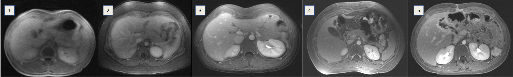
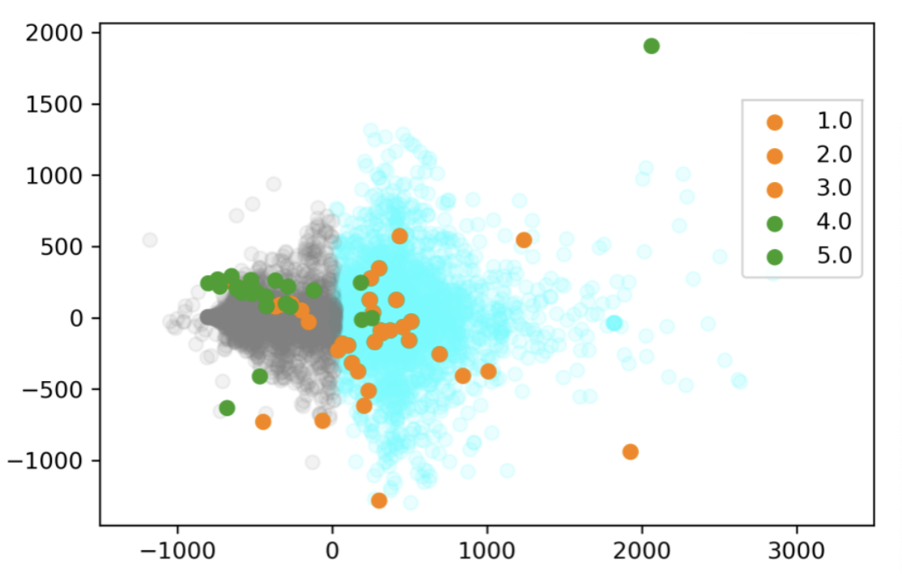
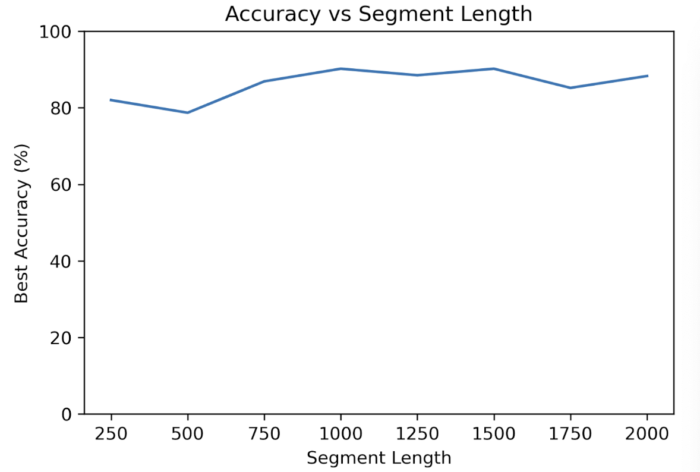
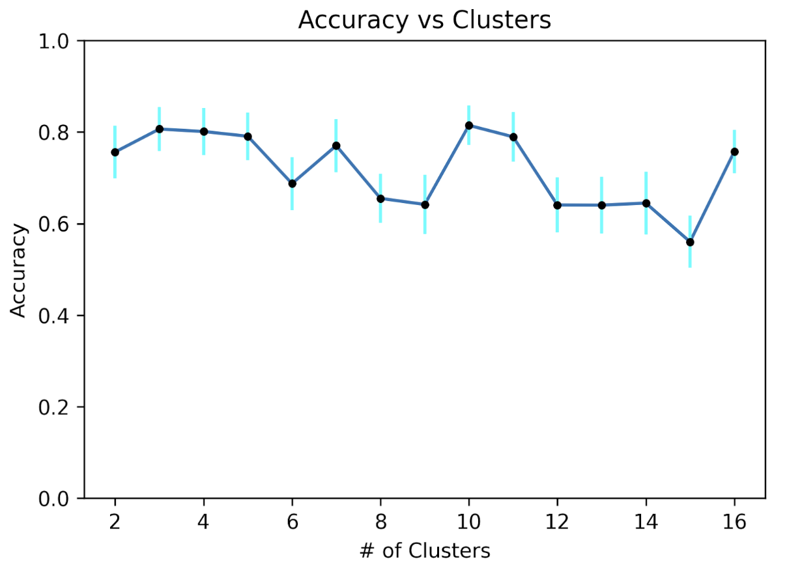
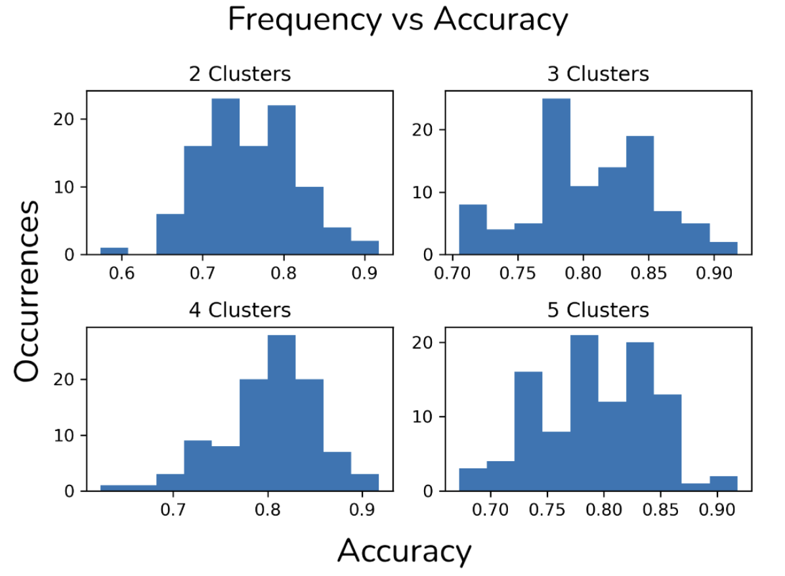
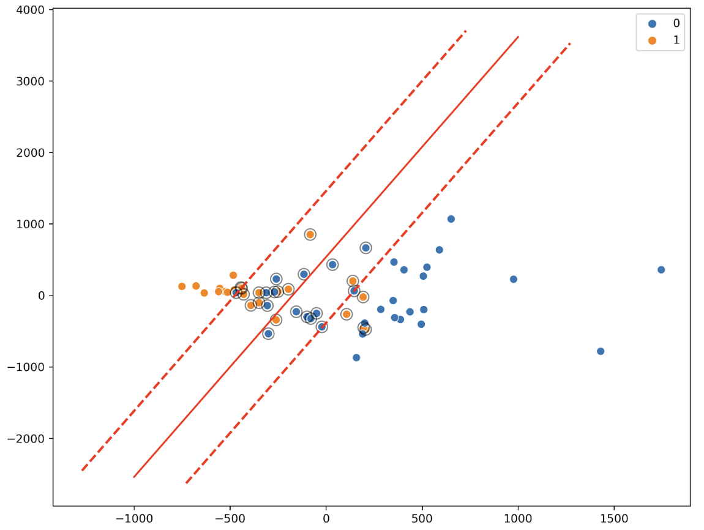

<!-----

You have some errors, warnings, or alerts. If you are using reckless mode, turn it off to see inline alerts.
* ERRORs: 0
* WARNINGs: 0
* ALERTS: 8

Conversion time: 1.818 seconds.

Using this Markdown file:

1. Paste this output into your source file.
2. See the notes and action items below regarding this conversion run.
3. Check the rendered output (headings, lists, code blocks, tables) for proper
   formatting and use a linkchecker before you publish this page.

Conversion notes:

* Docs to Markdown version 1.0β36
* Thu Jun 20 2024 17:31:58 GMT-0700 (PDT)
* Source doc: ISMRM version of the paper
* This document has images: check for >>>>>  gd2md-html alert:  inline image link in generated source and store images to your server. NOTE: Images in exported zip file from Google Docs may not appear in  the same order as they do in your doc. Please check the images!

----->

>>>>>  gd2md-html alert:  ERRORs: 0; WARNINGs: 0; ALERTS: 8.

<ul style="color: red; font-weight: bold"><li>See top comment block for details on ERRORs and WARNINGs. <li>In the converted Markdown or HTML, search for inline alerts that start with >>>>>  gd2md-html alert:  for specific instances that need correction.</ul>

Links to alert messages:
<a href="#gdcalert1">alert1</a>
<a href="#gdcalert2">alert2</a>
<a href="#gdcalert3">alert3</a>
<a href="#gdcalert4">alert4</a>
<a href="#gdcalert5">alert5</a>
<a href="#gdcalert6">alert6</a>
<a href="#gdcalert7">alert7</a>
<a href="#gdcalert8">alert8</a>

>>>>> PLEASE check and correct alert issues and delete this message and the inline alerts.

Predicting MR Image Quality from Breathing Patterns

Soham S Vasanawala1 and John M Pauly1

_1Electrical Engineering, Stanford University, Stanford, CA, United States_

### **Synopsis**

Motion, particularly from breathing, compromises the quality of magnetic resonance images. In this work, we hypothesize that detected breathing patterns can be utilized to predict whether adequate MR image quality will be obtained. With a K-means clustering algorithm, 9 in 10 forty-second breathing waveforms were correctly predicted as either resulting in a high or low image quality image; this finding can save time from unnecessary scans. Other models achieved similar results as K-means clusterings.

### **Introduction**

Respiratory motion compromises images. Non-Cartesian scanning [1] and intrinsic navigation [2] somewhat mitigate this problem. Little work has focused on predicting image quality, mostly on voluntary head movement [3].

Prior work characterized respiration for sedation monitoring [4] or radiotherapy tailoring [5, 6], and influencing respiratory motion [7]. [8] characterized breathing pattern and restricted data acquisition to portions of the respiratory cycle. However, limited work has explored modern machine learning methods to characterize breathing patterns [9].

We hypothesize that detected breathing patterns can be utilized to predict image quality; the predictions then trigger decisions to repeat scans, coach patients, choose alternative sequences, or omit scans to save time.

### **Methods**

Post-contrast motion-robust cones fat-suppressed SPGR with golden angle ordering [10] abdominal scans over an eighteen-month period were retrospectively identified with IRB approval and waived consent. Slice thickness and field-of-view were adjusted to patient size. 125 kHz bandwidth and 15° flip angle were utilized. Image reconstruction consisted of gridding and Fourier transform.

Corresponding breathing waveforms with 40 ms sampling rate from respiratory bellows were curated (Fig. 1, left). For a 61 waveform subset, a board-certified radiologist scored resulting image quality (Fig. 2), with scores of 4/5 deemed diagnostically adequate. The remaining 675 waveforms were unlabeled.

To sample the unlabeled set of respiratory waveforms, ten segments of equal length were randomly extracted from each respiratory waveform. To sample the labeled waveforms, one segment of each waveform was randomly extracted. The total of these extractions compose two groups of waveforms: labeled and unlabeled waveforms. These two groups of labeled and unlabeled respiratory waveforms were resampled at varying segment lengths in different trials. Thus, there was a labeled and unlabeled pair of groups of waveforms for each segment length.

K-means clustering was performed on the raw unlabeled waveform group (k=2-16). Clustering was performed twice: (i) with raw unlabeled waveforms, and (ii) on the autocorrelation of the waveforms (Fig. 1, right). With the exception of a singular datapoint withheld for testing, the assigned cluster of the remaining labeled data points were tabulated; the majority label determined the overall cluster label (low quality or high quality). The resulting labeled cluster model was then used to predict the image quality of the withheld data point. This process was repeated for each labeled datapoint being withheld, enabling calculation of specificity, sensitivity, and accuracy. Clustering was also performed on the unlabeled waveform group but autocorrelation (Fig. 1, right) preprocessing was used. Segment length varied from 250-2000 datapoints, with intervals of 250. Best accuracy was taken from the highest performing cluster.

The clustering method was run for 100 trials, except instead of using all 675 unlabeled datapoints in each trial, 300 randomly selected out of the 675 waveforms were used instead to prevent overfitting. Error bars are the standard deviation for that given number of clusters. The distribution of these hundred trials shows the hundred trials.

An RBF kernel support vector classifier was trained on 60% of the labeled waveforms, saving 40% for testing. The labeled waveforms were preprocessed via a two-dimensional PCA. A linear kernel was also used, and was trained on all of the labeled waveforms. RBF parameters were varied to determine their effect on accuracy. Precision/recall were calculated from test results. 2,000 trials were conducted for the RBF kernel. SciPy and scikit-learn libraries were used [11].

### **Results**

With K-means clustering (Fig. 3), note the separability of the high and low quality labeled waveforms and that the separation of unlabeled data mirrors the separation of high/low quality labeled waveforms, indicating that breathing waveforms corresponding to high/low quality images exhibit differences on average.

Prediction accuracy minimally depended on segment length (Fig. 4). 1000-datapoint waveforms achieved approximately 90% accuracy. Beyond 1000 datapoints, accuracy does not improve. As datapoints are separated by 40ms, 40 seconds of breathing waveform sampling suffices.

Ten clusters provided optimal accuracy (Fig. 5), though improvement over a simpler three-cluster model was minimal. In this experiment, segment length of 1000 points was used, as it was a relative maximum of the graph in Fig. 4. Model performance is relatively repeatable, with narrow error bars. As a representative example, the four-cluster models’ performance distribution are shown in Fig. 6.

SVM was also qualitatively compared to the clustering algorithm. The unsupervised clustering algorithm was trained on the unlabeled dataset leaving the labeled dataset for testing purposes, whereas the supervised SVM required the labeled data only. Fig. 7 indicates that the SVM with a linear kernel can achieve good classification; equivalent accuracy was obtained compared to a 2-cluster model (Fig. 3). Finally, optimization of the RBF’s (nonlinear kernel) C and gamma values demonstrated that decision boundary with less curvature had higher performance (Fig. 8). 

### **Discussion**

Image quality prediction from respiratory pattern is feasible. As only a short respiratory waveform segment is required, scans can be aborted early with 90% accuracy. Since waveforms can be collected prior to scanning, the clustering model enables accurate image quality prediction before scanning.

It remains unclear whether a high-performing model tested on the 61 labels will continue to perform equally high in a clinical setting. Future work will focus on other sequences.

### **Acknowledgements**

No acknowledgement found.

### **References**

1. Zhang Y, Kashani R, Cao Y, Lawrence TS, Johansson A, Balter JM.. A hierarchical model of abdominal configuration changes extracted from golden angle radial magnetic resonance imaging. Phys Med Biol. 2021 Feb 9;66(4):045018. doi: 10.1088/1361-6560/abd66e. PMID: 33361579

2. Liu L, Johansson A, Cao Y, Lawrence TS, Balter JM. Volumetric prediction of breathing and slow drifting motion in the abdomen using radial MRI and multi-temporal resolution modeling. Phys Med Biol. 2021 Sep 3;66(17):10.1088/1361-6560/ac1f37. doi: 10.1088/1361-6560/ac1f37. PMID: 34412047

3. Wallace TE, Afacan O, Jaimes C, Rispoli J, Pelkola K, Dugan M, Kober T, Warfield SK. Free induction decay navigator motion metrics for prediction of diagnostic image quality in pediatric MRI. Magn Reson Med. 2021 Jun;85(6):3169-3181. doi: 10.1002/mrm.28649. Epub 2021 Jan 6. PMID: 33404086

4. Caldiroli D, Minati L. Early experience with remote pressure sensor respiratory plethysmography monitoring sedation in the MR scanner. Eur J Anaesthesiol. 2007 Sep;24(9):761-9. doi: 10.1017/S0265021507000312. Epub 2007 May 22. PMID: 17517150

5. Cai J, Read PW, Sheng K. The effect of respiratory motion variability and tumor size on the accuracy of average intensity projection from four-dimensional computed tomography: an investigation based on dynamic MRI. Med Phys. 2008 Nov;35(11):4974-81. doi: 10.1118/1.2982245. PMID: 19070231

6. Ostyn M, Weiss E, Rosu-Bubulac M. Respiratory cycle characterization and optimization of amplitude-based gating parameters for prone and supine lung cancer patients. Biomed Phys Eng Express. 2020 Mar 4;6(3):035002. doi: 10.1088/2057-1976/ab779d. PMID: 33438647

7. To DT, Kim JP, Price RG, Chetty IJ, Glide-Hurst CK. Impact of incorporating visual biofeedback in 4D MRI. J Appl Clin Med Phys. 2016 May 8;17(3):128-137. doi: 10.1120/jacmp.v17i3.6017. PMID: 27167270

8. Sinkus R, Börnert P. Motion pattern adapted real-time respiratory gating. Magn Reson Med. 1999 Jan;41(1):148-55. doi: 10.1002/(sici)1522-2594(199901)41:1&lt;148::aid-mrm21>3.0.co;2-g. PMID: 10025623

9. Nallanthighal VS, Mostaani Z, Härmä A, Strik H, Magimai-Doss M. Deep learning architectures for estimating breathing signal and respiratory parameters from speech recordings. Neural Netw. 2021 Sep;141:211-224. doi: 10.1016/j.neunet.2021.03.029. Epub 2021 Apr 5. PMID: 33915446

10. Zucker EJ, Cheng JY, Haldipur A, Carl M, Vasanawala SS. Free-breathing pediatric chest MRI: Performance of self-navigated golden-angle ordered conical ultrashort echo time acquisition J Magn Reson Imaging, 2018 Jan;47(1):200-209. doi: 10.1002/jmri.25776. PMID: 28570032

11. Scikit-learn: Machine Learning in Python, Pedregosa et al., JMLR 12, pp. 2825-2830, 2011.

### **Figures**

>>>>>  gd2md-html alert: inline image link here (to images/image1.png). Store image on your image server and adjust path/filename/extension if necessary.  (<a href="#">Back to top</a>)(<a href="#gdcalert2">Next alert</a>) >>>>> 

Figure 1. Left: 1000 data point segment from representative bellows breathing waveform. Right: corresponding autocorrelation function.

>>>>>  gd2md-html alert: inline image link here (to images/image2.png). Store image on your image server and adjust path/filename/extension if necessary.  (<a href="#">Back to top</a>)(<a href="#gdcalert3">Next alert</a>) >>>>> 

Figure 2. Example image quality scores of 1 to 5.

>>>>>  gd2md-html alert: inline image link here (to images/image3.png). Store image on your image server and adjust path/filename/extension if necessary.  (<a href="#">Back to top</a>)(<a href="#gdcalert4">Next alert</a>) >>>>> 

Figure 3. K-means clustering (k = 2) on a principal component analysis on 1000-data-point segment length labeled with green and orange representing high and low quality labels, respectively. Unlabeled waveform clusters are shown in faded gray and cyan. Here, we qualitatively establish that the breathing waveforms are mathematically separable into high and low quality categories.

>>>>>  gd2md-html alert: inline image link here (to images/image4.png). Store image on your image server and adjust path/filename/extension if necessary.  (<a href="#">Back to top</a>)(<a href="#gdcalert5">Next alert</a>) >>>>> 

Figure 4. The effect of respiratory waveform segment length on best accuracy over a range of number of clusters. A segment length of at least 1000 points long, or 40 seconds of breathing, was sufficient to maximize prediction accuracy. 

>>>>>  gd2md-html alert: inline image link here (to images/image5.png). Store image on your image server and adjust path/filename/extension if necessary.  (<a href="#">Back to top</a>)(<a href="#gdcalert6">Next alert</a>) >>>>> 

Figure 5. Accuracy as a function of clusters, with standard deviation estimation from 100 trials per cluster number. In each trial, the k-means clustering model was trained on 300 randomly selected unlabeled waveforms. Although a ten-cluster model achieved the highest performance, its difference to a three-cluster model was statistically insignificant. More clusters did not necessarily better categorize the waveform dataset.

>>>>>  gd2md-html alert: inline image link here (to images/image6.png). Store image on your image server and adjust path/filename/extension if necessary.  (<a href="#">Back to top</a>)(<a href="#gdcalert7">Next alert</a>) >>>>> 

Figure 6. Distribution of accuracy from 100 trials of repeated training of the model in the case of the four-cluster model. Since random segments of waveforms were utilized in each trial of training the model, variability in the accuracy of the model can be assessed, as displayed in the error bars in Figure 5.

>>>>>  gd2md-html alert: inline image link here (to images/image7.png). Store image on your image server and adjust path/filename/extension if necessary.  (<a href="#">Back to top</a>)(<a href="#gdcalert8">Next alert</a>) >>>>> 

Figure 7. Support vector machine (with linear kernel) trained and plotted against labeled data. Circled points indicate support vectors. All labeled datapoints are shown. This separation’s division shows a similarity to that in Fig. 3 and hence corresponds to a similar performance. 

>>>>>  gd2md-html alert: inline image link here (to images/image8.png). Store image on your image server and adjust path/filename/extension if necessary.  (<a href="#">Back to top</a>)(<a href="#gdcalert9">Next alert</a>) >>>>> 

Figure 8. (a) Parameter (gamma and C) optimization for the radial Bessel function kernel support vector machine. (b) a re-run of values within the cyan rectangle. The C value determines the acceptable error for the decision boundary, while gamma controls the curvature of the decision boundary. From (a) we conclude that the breathing waveforms were best separated into high and low image quality categories with low gamma, or a decision boundary with less curvature. The grid in (b) further suggests that the low curvature best divides the data and indicates that a C-value was less of a determining factor for performance.
